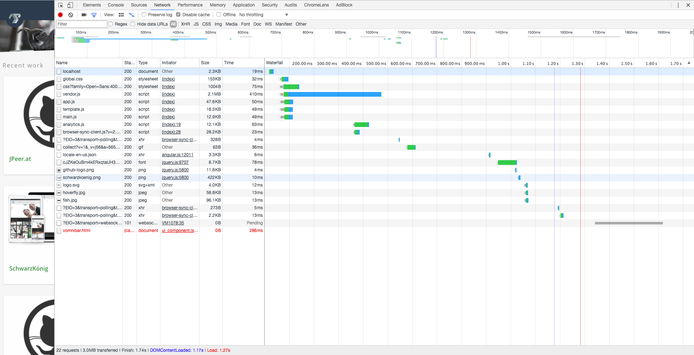
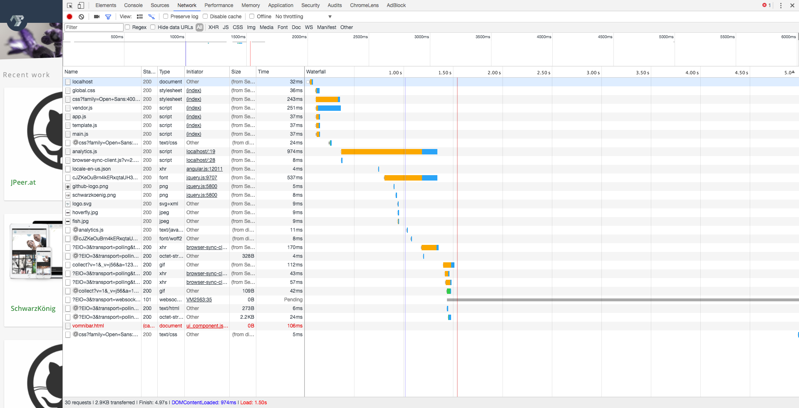

# JPeer.at

This page is entirely made with AngularJS. Why a framework for such a small application? Well, it is fun to play around with different frameworks, so here I decided to make my page with AngularJS.

## Service Worker

I couldn't see any performance improvements. It's offline available though.




## Usage

> Note: make sure you have installed Node 4+ and npm 3+ installed. [More info](https://nodejs.org/)

> Note: [gulp](https://www.npmjs.com/package/gulp) must be installed globally - `npm i -g gulp-cli`

First of, you have to install all necessary dependencies by typing in following commands in your terminal:

```sh
npm i
bower i
```

**Development**

This will start a server and point into the `tmp` directory. When a file in the `src` directory is changed, it will automatically refresh the browser.

```sh
gulp serve
```

**Documentation**

This will start a server and point into the `docs` directory. The documentation is made with `ngdocs`.

```sh
gulp serve:docs
```

**Build**

There are two ways for building the application, first the staging version. The files are then located in the `tmp` directory:

```sh
gulp build:dev
```

Secondly for the production. The files are then located in the `prod` directory.

```sh
gulp build:prod
```
